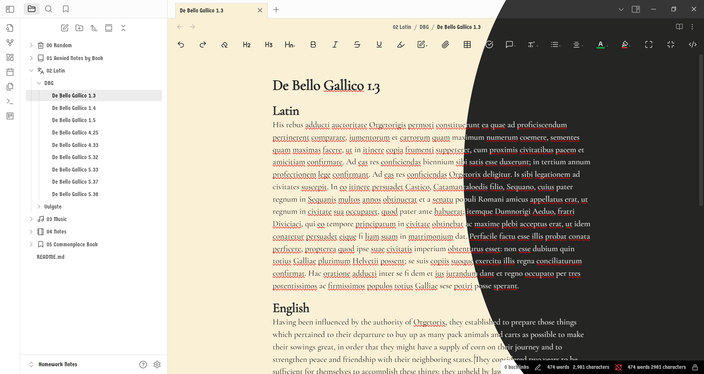

# Soli Deo Gloria
Hello! This is my *Soli Deo Gloria* theme. As you can see, the title is in a different language. This language is Latin and *Soli Deo Gloria* translates to: "Glory to God alone."

My inspiration is from old German bibles and Gothic Style of calligraphy. In this theme I aim to draw out the beauty in old sacred texts and bring it into a modern format. The design incorporates elements inspired by the intricate detail and flowing script found in illuminated manuscripts. Expect a clean, uncluttered interface that prioritizes readability and focuses on enhancing your Obsidian note-taking experience.

## Fonts
- Germania-One
- Cormorant Garamond
## Colors
- Light Theme
	- Primary: # ECDFB8
	- Secondary: # 171614
	- Tertiary: # 75704E
- Dark Theme
	- Primary: # 252523
	- Secondary: # 000000
	- Tertiary: # 000000
## Plugins
I have tested the following plugins:
- File Color
- Editing Toolbar
- Iconize
- Kanban

## Thanks
If you chose to download my theme, I appreciate it. This is only my second theme on Obsidian, so there may be numerous mistakes. Please let me know if there are any issues. 

**To God be all the glory**: GodlyMan
## Attribution
All code and images are under CC BY-SA 4.0
Germania-One font: https://www.fontsquirrel.com/license/germania-one
Cormorant Garamond: https://fonts.google.com/specimen/Cormorant+Garamond
